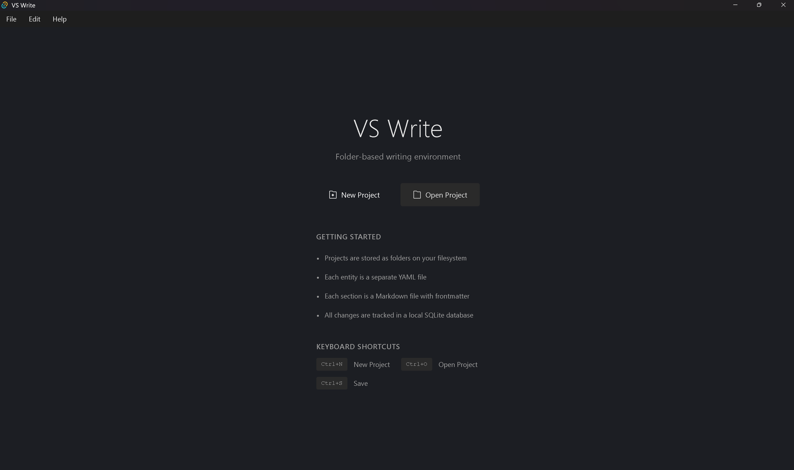
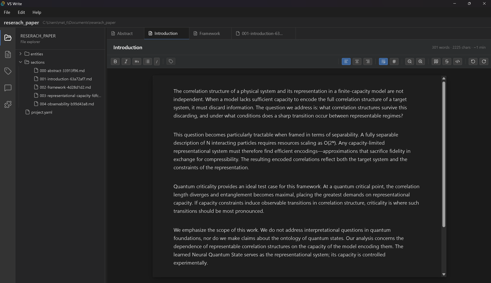
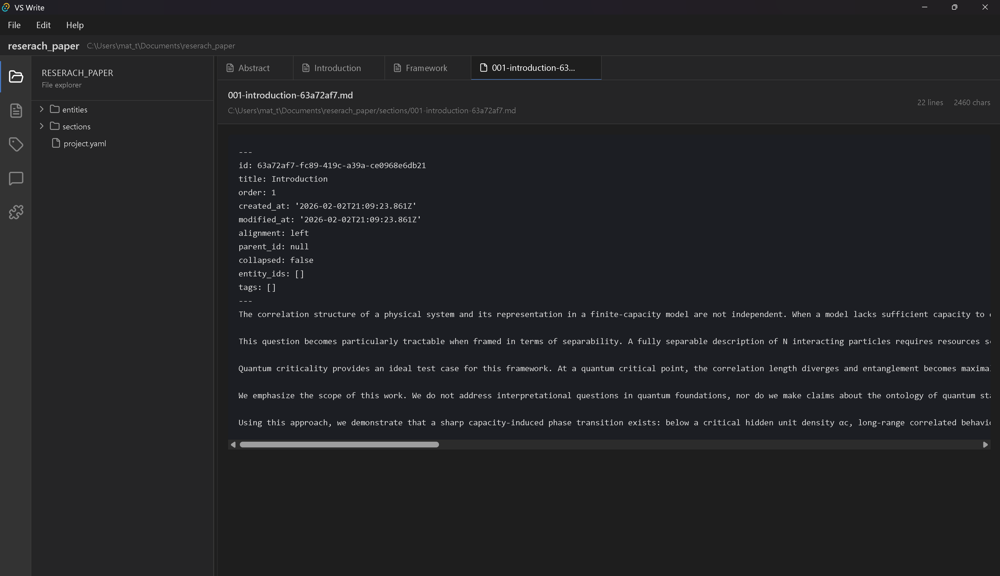
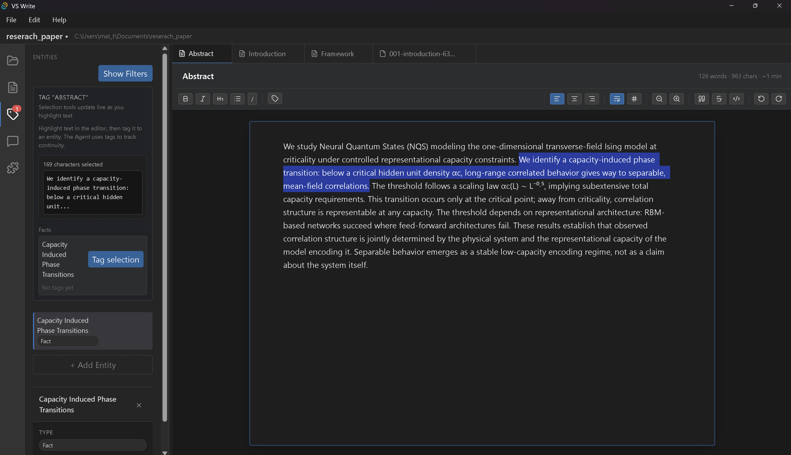
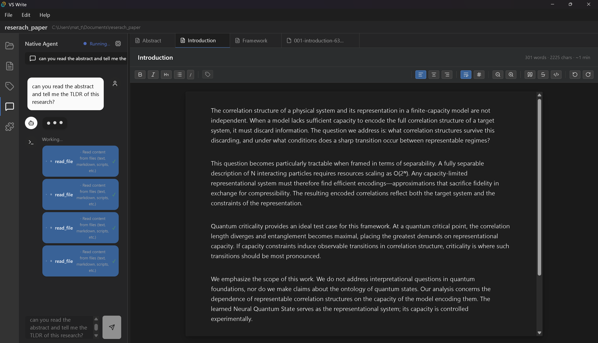
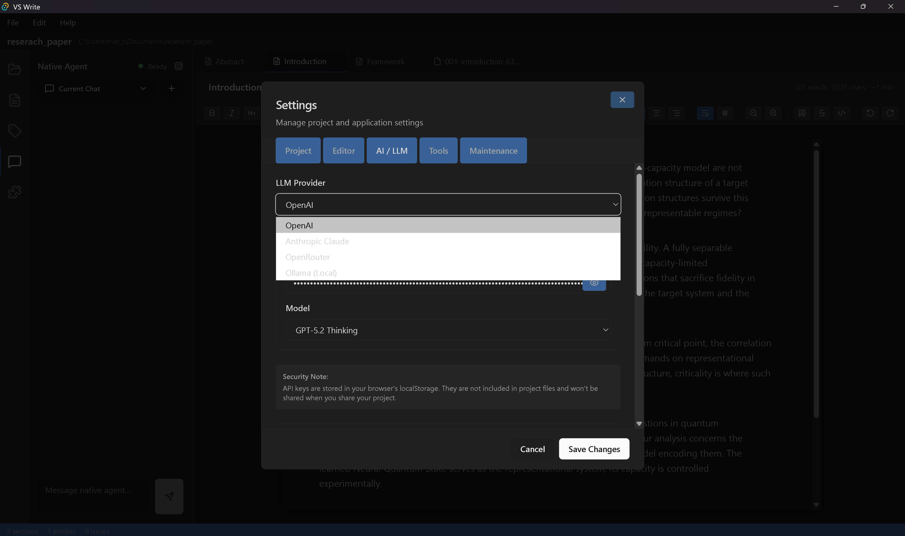
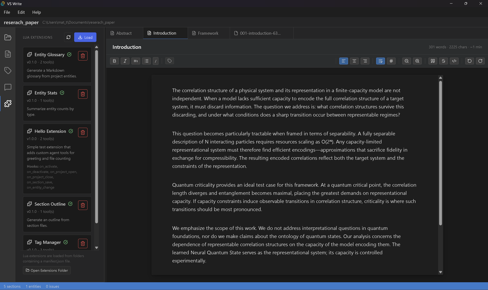

# VS Write

A folder-based writing environment with entity tracking and AI assistance.



## What is this?

VS Write is a desktop editor for writers, researchers, and anyone working with structured documents. Your project is a folder. Sections are Markdown files. Entities (characters, concepts, claims) are YAML files. Everything is human-readable and version-control friendly.

The built-in AI agent understands your project structure and can help with research, summarization, and consistency checking.

## Quick Start

**Prerequisites:** Node.js 18+ and Rust toolchain

```bash
git clone https://github.com/Mat-Tom-Son/vs-write.git
cd vs-write
npm install
npm run tauri:dev
```

That's it. The app will open and you can create or open a project.

## Features

### Write in Sections

Organize your work into sections (chapters, scenes, papers). Each section is a Markdown file with a rich text editor.



- Multi-tab editing
- Formatting toolbar (bold, italic, headings, lists)
- Word count tracking
- Drag-and-drop reordering

### Plain Text Files

Your content stays in standard formats you can read anywhere. Sections are Markdown with YAML frontmatter. Open them in any editor.



```
my-project/
  project.yaml           # Project metadata
  entities/
    character-abc12.yaml # Entity definitions
  sections/
    001-chapter-1.md     # Markdown + frontmatter
    002-chapter-2.md
```

### Track Entities

Define characters, locations, concepts, rules, or any custom type. Tag text selections to link them to entities. The AI uses these connections for consistency checking.



- Six entity types (character, location, concept, item, rule, custom)
- Inline tagging with visual highlights
- Entity descriptions as "source of truth" for AI analysis

### AI Agent

Chat with an AI that understands your project. It can read your files, answer questions, and help with research.



- Native Rust agent (runs in-process, no separate server)
- Tool calling: read/write files, search, run commands
- Project context injected automatically
- Supports OpenAI, Claude, Ollama, and OpenRouter

### Multiple LLM Providers

Use cloud APIs or run models locally. Configure in Settings.



| Provider | Use Case |
|----------|----------|
| OpenAI | Cloud API, also works with OpenAI-compatible servers (LM Studio, etc.) |
| Anthropic | Claude models via cloud API |
| OpenRouter | Single API for multiple model providers |
| Ollama | Run open-source models locally, fully offline |

### Extend with Lua

Add custom tools and hooks with Lua extensions. No compilation needed.



- Custom AI tools that appear in the agent
- Lifecycle hooks (project open/close, section save, entity change)
- Built-in marketplace with example extensions
- Entity API for reading/writing project data

See [`examples/`](examples/) for extension templates.

## Tech Stack

| Layer | Technology |
|-------|------------|
| Frontend | React 19, TypeScript, Vite 7, CodeMirror 6, Zustand, Tailwind |
| Desktop | Tauri 2 (Rust) |
| Database | SQLite (cache/index layer) |
| AI | Native Rust agent with multi-provider LLM support |

## Documentation

- [Contributing Guide](CONTRIBUTING.md) - How to set up development and submit PRs
- [Extension Development](docs/extension-development.md) - Build custom extensions
- [Security Policy](SECURITY.md) - Reporting vulnerabilities

## Development

```bash
npm run dev          # Web-only (limited features)
npm run tauri:dev    # Desktop app with full features
npm run build        # Production web build
npm run tauri:build  # Desktop installer (.exe, .app, .AppImage)
npm run lint         # ESLint
npm run test         # Vitest
```

For Rust:
```bash
cd src-tauri
cargo test
cargo clippy
```

## Project Status

VS Write is functional and usable, but still in early development (v0.1.0). Expect rough edges.

**Working well:**
- Section editing and organization
- Entity management and tagging
- AI agent with tool calling
- Lua extension system
- Multi-provider LLM support

**Planned:**
- Export to PDF, EPUB, HTML
- Online extension marketplace
- Custom UI panels from extensions
- Auto-update mechanism

## Contributing

Contributions are welcome. Please read [CONTRIBUTING.md](CONTRIBUTING.md) before submitting PRs.

Good first issues are labeled in the issue tracker.

## License

MIT License - see [LICENSE](LICENSE) for details.
